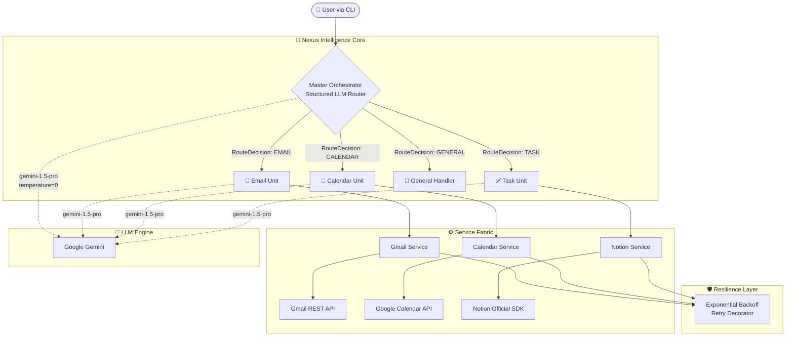

<div align="center">

# 🌌 Nexus AI
<br/>

[](https://python.org)
[](https://langchain.com)
[](https://ai.google.dev)
[](./LICENSE)
[](https://github.com)
[](./CONTRIBUTING.md)

<br/>

> *"Nexus doesn't just manage your tasks. It reclaims your time."*

**Nexus AI** is a production-grade, **multi-agent orchestration system** that eliminates the cognitive overhead of modern digital work. By integrating deeply with Gmail, Google Calendar, and Notion, Nexus acts as your autonomous executive assistant — processing communications, scheduling intelligently, and organizing priorities with surgical precision.

<br/>

[**✨ Features**](#-core-capabilities) • [**🏗️ Architecture**](#️-architecture) • [**🚀 Quick Start**](#-quick-start) • [**🧪 Testing**](#-testing) • [**🔭 Roadmap**](#-roadmap) • [**🤝 Contributing**](#-contributing)

---

</div>

## 🧠 The Problem We Solve

Modern knowledge workers lose **2.5 hours/day** to the *Digital Toll* — context switching between Gmail, Calendar, and project management tools. Nexus AI eliminates this by providing:

| Without Nexus | With Nexus |
|:---|:---|
| 9 tabs open, 3 inboxes unchecked | One intelligent interface |
| Manual calendar coordination | Autonomous conflict detection |
| Scattered task management | Instant triage to Notion |
| Reactive communication | Proactive synthesized briefings |

---

## ✨ Core Capabilities

### ⚡ Master Orchestrator
The neural center of Nexus. Uses **structured LLM output** and **zero-temperature intent routing** to delegate requests to the most qualified intelligence unit with full reasoning traceability.

- **Structured Routing:** Pydantic-validated decisions with `destination` + `reasoning` fields
- **Workflow Engine:** Pre-built multi-step workflows (`daily_summary`, expandable)
- **Fallback Resilience:** Graceful degradation when primary routing fails

### 📧 Email Intelligence Unit (Gmail)
More than a reader — a full communications intelligence layer.
- **Thread Synthesis:** Collapses entire discussions into actionable bullet points
- **Priority Tiering:** Surfaces signal from noise automatically
- **Natural Language Interface:** *"What did Sarah say about the Q3 budget?"*

### 📅 Temporal Management Unit (Google Calendar)
Precision scheduling without the back-and-forth.
- **Smart Event Creation:** Interprets `"sometime next Tuesday afternoon"` into a concrete event
- **Conflict Vigilance:** Detects scheduling overlaps *before* they become problems
- **Dynamic Lifecycle:** Reschedule or cancel events with a single command

### ✅ Organizational Structure Unit (Notion)
The bridge between inspiration and execution.
- **Instant Triage:** Converts email action items into Notion database entries
- **Full CRUD:** Create, read, update, and delete tasks via natural language
- **Status Tracking:** Manages task lifecycle from `Backlog` → `Completed`

### 🖥️ Rich CLI Interface
A beautiful, production-grade terminal experience powered by `rich`.
- Color-coded responses with styled panels
- Live loading spinners during synthesis
- Persistent structured logging to `nexus_ai.log`

---

## 🏗️ Architecture

Nexus is built on a **4-Layer Decoupled Framework** designed for horizontal scalability and clean separation of concerns.



### Project Structure

```
nexus-ai/
├── src/
│   ├── agents/
│   │   ├── orchestrator.py      # Master routing engine (structured output)
│   │   ├── email_agent.py       # Gmail intelligence unit (LangGraph ReAct)
│   │   ├── calendar_agent.py    # Calendar intelligence unit
│   │   ├── task_agent.py        # Notion intelligence unit
│   │   └── notification_agent.py# Email notification tool
│   ├── services/
│   │   ├── auth_service.py      # Google OAuth2 flow manager
│   │   ├── gmail_service.py     # Gmail API client
│   │   ├── calendar_service.py  # Google Calendar API client
│   │   └── notion_service.py    # Notion SDK client
│   ├── tools/
│   │   ├── gmail_tools.py       # LangChain Gmail tools
│   │   ├── calendar_tools.py    # LangChain Calendar tools
│   │   └── notion_tools.py      # LangChain Notion tools
│   ├── utils/
│   │   ├── config.py            # Pydantic settings (type-safe env vars)
│   │   └── helpers.py           # Retry decorator, LangGraph adapter
│   └── main.py                  # Rich CLI entry point
├── tests/
│   ├── test_agents.py
│   ├── test_performance.py
│   └── test_*_manual.py
├── .github/
│   └── workflows/
│       └── ci.yml               # Automated CI pipeline
├── .env.example                 # Environment variable template
├── requirements.txt
├── CONTRIBUTING.md
└── LICENSE
```

---

## 🛠️ Tech Stack

| Layer | Technology | Version | Purpose |
|:---|:---|:---|:---|
| **Runtime** | Python | 3.10+ | Primary execution environment |
| **Orchestration** | LangGraph | Latest | Stateful multi-agent graph execution |
| **LLM Framework** | LangChain Core | Latest | Tool binding & prompt engineering |
| **LLM Engine** | Google Gemini 1.5 Pro | via API | Reasoning, synthesis & structured output |
| **Email** | Gmail REST API | v1 | Read, search & send emails |
| **Calendar** | Google Calendar API | v3 | Event management & scheduling |
| **Tasks** | Notion API | v1 | Structured organizational data |
| **Validation** | Pydantic v2 | v2+ | Type-safe settings & structured output |
| **CLI** | Rich | Latest | Beautiful terminal UI |

---

## 🚀 Quick Start

### Prerequisites

- Python 3.10+
- A [Google Cloud Project](https://console.cloud.google.com/) with **Gmail API** and **Google Calendar API** enabled
- A [Notion Integration](https://www.notion.so/my-integrations) token
- A [Google Gemini API Key](https://ai.google.dev/)

### 1. Clone & Install

```bash
# Clone the repository
git clone https://github.com/YOUR_USERNAME/nexus-ai.git
cd nexus-ai

# Create and activate virtual environment
python -m venv venv
source venv/bin/activate        # Linux / macOS
# OR
venv\Scripts\activate           # Windows

# Install dependencies
pip install -r requirements.txt
```

### 2. Configure Google OAuth

1. In Google Cloud Console, create an **OAuth 2.0 Client ID** (Desktop App)
2. Download `credentials.json`
3. Place it inside a `credentials/` directory at the project root:
   ```
   nexus-ai/
   └── credentials/
       └── credentials.json
   ```

### 3. Configure Environment

```bash
cp .env.example .env
```

Open `.env` and populate all values:

```env
# Google OAuth Credentials
GOOGLE_CLIENT_ID=your_google_client_id
GOOGLE_CLIENT_SECRET=your_google_client_secret

# Notion Integration
NOTION_API_KEY=secret_your_notion_key
NOTION_DATABASE_ID=your_database_id

# LLM Engine
GEMINI_API_KEY=your_gemini_api_key

# Logging (DEBUG | INFO | WARNING | ERROR)
LOG_LEVEL=INFO
```

### 4. Launch Nexus

```bash
python -m src.main
```

On first run, a browser window will open for Google OAuth. After authorization, a token is cached in `credentials/token.json` for subsequent runs.

---

## 💡 Usage Examples

Once running, interact with Nexus naturally:

```
λ Nexus > Summarize my unread emails from the last 24 hours
λ Nexus > Schedule a team sync for next Thursday at 2pm called "Q3 Review"
λ Nexus > Create a high-priority Notion task: "Finalize pitch deck by Friday"
λ Nexus > Do I have any calendar conflicts this week?
λ Nexus > Give me my full daily briefing
```

**Daily Briefing Workflow:**
```
λ Nexus > run daily summary
```
Nexus will pull your calendar events, high-priority tasks, and top emails, then synthesize a structured executive briefing with tactical advice.

---

## 🧪 Testing

```bash
# Run the full test suite
python -m pytest tests/ -v

# Run performance benchmarks
python -m pytest tests/test_performance.py -v

# Run individual manual integration tests
python tests/test_email_agent_manual.py
python tests/test_calendar_agent_manual.py
python tests/test_orchestrator_manual.py
```

> **Note:** Manual tests require a fully configured `.env` and valid Google credentials.

---

## 🔭 Roadmap

| Phase | Feature | Status |
|:---|:---|:---|
| **v1.0** | Multi-agent orchestration with Gmail, Calendar, Notion | ✅ Complete |
| **v1.1** | Structured LLM routing + Rich CLI | ✅ Complete |
| **v2.0** | Real-time WebSocket dashboard (Next.js) | 🔜 Planned |
| **v2.1** | Persistent memory via Vector Embeddings (ChromaDB) | 🔜 Planned |
| **v3.0** | Voice Interface (Whisper API) | 💡 Backlog |
| **v3.1** | Autonomous multi-user workspace collaboration | 💡 Backlog |
| **v4.0** | Slack / Microsoft Teams integration | 💡 Backlog |

---

## 🤝 Contributing

Contributions are welcome! Please read the [CONTRIBUTING.md](./CONTRIBUTING.md) guide first. In short:

1. Fork the repo
2. Create a feature branch: `git checkout -b feature/your-feature-name`
3. Commit your changes: `git commit -m 'feat: add amazing feature'`
4. Push and open a Pull Request

All PRs are automatically tested via GitHub Actions CI.

---

## 📄 License

This project is licensed under the **MIT License** — see the [LICENSE](./LICENSE) file for details.

---

<div align="center">

**Built for those who demand excellence from their digital ecosystem.**

*If Nexus reclaimed your time, give it a star ⭐*

[](https://github.com/YOUR_USERNAME/nexus-ai)

</div>
